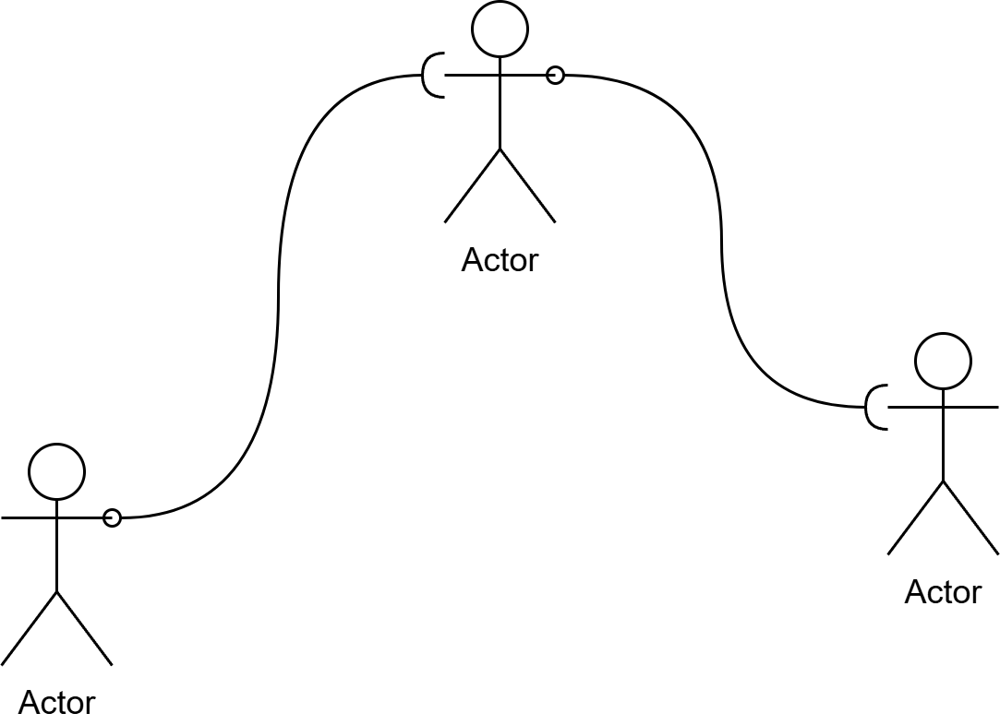

# Linked List 链表

链表是一种线性数据结构，它通过指针链接一系列节点来存储数据。

你可以想象为站在不同地方的人手里拿着绳子连在一起，虽然不知道彼此具体在哪，但总是可以通过绳子进行沟通。



## 节点

在链表中，所有的数据都被保存在**节点**中，每个节点保存着指向下一个节点的指针。

让我们从定义节点开始。

```zig
pub fn LinkedListNode(comptime T: type) type {
    return struct {
        const This = @This();
        data: T,
        next: ?*This,

        pub fn init(data: T) This {
            return .{
                .data = data,
                .next = null,
            };
        }
    };
}
```

显而易见的，我们需要一个init函数来初始化节点。不过我们不需要deinit函数，我们会将所有节点的deinit放置在链表中。

## 链表的初始化和反初始化

接下来，我们实现链表最基本的两个函数——初始化和反初始化。

```zig
pub fn LinkedList(comptime T: type) type {
    return struct {
        const Node = LinkedListNode(T);
        const This = @This();
        allocator: std.mem.Allocator,
        head: ?*Node,
        length: usize,

        pub fn init(allocator: std.mem.Allocator) This {
            return .{
                .allocator = allocator,
                .head = null,
                .length = 0,
            };
        }

        pub fn deinit(self: *This) void {
            var next = self.head;
            while (next != null) {
                const cur = next.?;
                next = cur.next;
                if (@hasDecl(T, "deinit")) {
                    // 反初始化节点里的数据
                    cur.data.deinit();
                }
                // 释放节点
                self.allocator.free(cur);
            }
        }
    };
}
```

我们从成员开始看起。

首先，我们要保存节点的类型为Node，保存本身的类型This。我们需要保存第一个节点的指针。另外，为了方便判断长度，我们保存长度为length。

::: details 为什么保存length?
和列表一样，链表的长度应该等于链表中元素的数量。

因为链表中的元素是分散在各处的，必须要通过指针一个一个数。沿用前面的比喻，就像让人通过绳子一个一个报数。显然，伴随着人越来越多，这个过程将会越来越慢。

为了加速这个过程，我们直接保存长度，在增加节点和删除节点时修改这个值。
:::

然后，让我们看初始化函数。初始化函数非常的普通，只是保存一些必要的信息。

最后是反初始化方法。

第一眼望去，我们看到了一个先前没有见过的函数`@hasDecl()`。这同样是一个内建函数，它可以判断传入的类型（第一个参数）是否声明了给定的成员（第二个参数）。这有一点像一些语言中的反射。在这里，我们通过这个函数来判断节点里的数据需不需要反初始化，需要则执行反初始化。

Ok，到这里我们可以想想需要什么方法了。

🚧施工中🚧

- 增、删、查节点的基本操作
