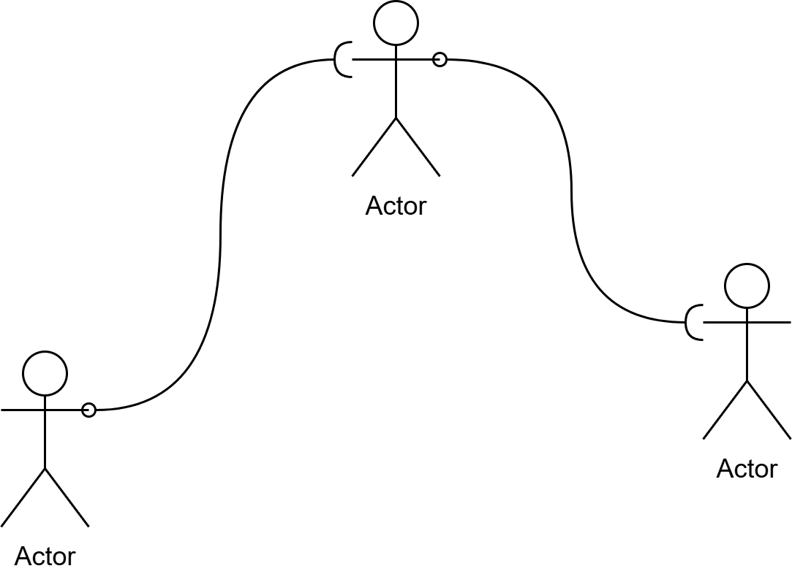

# Linked List 链表

链表是一种线性数据结构，它通过指针链接一系列节点来存储数据。

你可以想象为站在不同地方的人手里拿着绳子连在一起，虽然不知道彼此具体在哪，但总是可以通过绳子进行沟通。



在开始前，我还要再重复一遍我的意见：不要将我们实现的代码投入到生产中。Zig标准库提供了[std.SinglyLinkedList](https://ziglang.org/documentation/master/std/#std.SinglyLinkedList)这一实现。

## 节点

在链表中，所有的数据都被保存在**节点**中，每个节点保存着指向下一个节点的指针。

让我们从定义节点开始。

```zig -skip
pub fn LinkedListNode(comptime T: type) type {
    return struct {
        const This = @This();
        data: T,
        next: ?*This,

        pub fn init(data: T) This {
            return .{
                .data = data,
                .next = null,
            };
        }
    };
}
```

显而易见的，我们需要一个init函数来初始化节点。不过我们不需要deinit函数，我们会将所有节点的deinit放置在链表中。

## 链表的初始化和反初始化

接下来，我们实现链表最基本的两个函数——初始化和反初始化。

```zig -skip
const std = @import("std");
pub fn LinkedList(comptime T: type) type {
    return struct {
        const Node = LinkedListNode(T);
        const This = @This();
        allocator: std.mem.Allocator,
        head: ?*Node,
        length: usize,

        pub fn init(allocator: std.mem.Allocator) This {
            return .{
                .allocator = allocator,
                .head = null,
                .length = 0,
            };
        }

        pub fn deinit(self: *This) void {
            var next = self.head;
            while (next != null) {
                const cur = next.?;
                next = cur.next;
                switch (@typeInfo(T)) {
                    .@"struct", .@"enum", .@"union" => {
                        if (@hasDecl(T, "deinit")) {
                            // 反初始化节点里的数据
                            cur.data.deinit();
                        }
                    },
                    else => {},
                }
                // 释放节点
                self.allocator.destroy(cur);
            }
        }
    };
}
```

我们从成员开始看起。

首先，我们要保存节点的类型为Node，保存本身的类型This。我们需要保存第一个节点的指针。另外，为了方便判断长度，我们保存长度为length。

::: details 为什么保存length?
和列表一样，链表的长度应该等于链表中元素的数量。

因为链表中的元素是分散在各处的，必须要通过指针一个一个数。沿用前面的比喻，就像让人通过绳子一个一个报数。显然，伴随着人越来越多，这个过程将会越来越慢。

为了加速这个过程，我们直接保存长度，在增加节点和删除节点时修改这个值。
:::

然后，让我们看初始化函数。初始化函数非常的普通，只是保存一些必要的信息。

最后是反初始化方法。

第一眼望去，我们看到了一个先前没有见过的函数`@hasDecl()`。这同样是一个内建函数，它可以判断传入的类型（第一个参数）是否声明了给定的成员（第二个参数）。这有一点像一些语言中的反射。在这里，我们通过这个函数来判断节点里的数据需不需要反初始化，需要则执行反初始化。

然后是一些神奇的标识符：`@"struct"`,`@"enum"`以及`@"union"`。这些是Zig中的一些特殊语法，以这种方式可以让标识符等于关键词。在这里，我们要判断T是不是结构体，枚举或者联合，所以我们用到了内建函数`@typeInfo(T)`。

这里我们还使用到了`switch`语法。`switch`是一种穷举的匹配，逐个对比给定的值是否符合列出的值，然后执行第一个符合的值后面的代码，如果都不符合就执行else后面的代码。

Ok，到这里我们可以想想需要什么方法了。

## 链表的常用方法

类似于列表，我们第一个想到的就是最基本的增删查改：

1. nth(n)：获取第n个节点；
2. append(v)：在链表末尾追加元素v；
3. remove(node)：从链表中移除节点node；

和列表不同，在链表中我们一般不通过下标访问。我们主要访问第一个元素和最后一个元素，所以我们还有下面的方法：

1. prepend(v)：在链表头插入元素v；
2. popFirst()：移除链表头上的节点；
3. popLast()：移除链表末尾的节点；

::: tip
在这里，我们使用元素作为插入的单位，这样子我们可以让链表自己来负责节点的初始化和反初始化。但在一些实现中，插入的单位是节点，例如Zig的标准库[std.SinglyLinkedList](https://ziglang.org/documentation/master/std/#std.SinglyLinkedList)。
:::

### nth

我们要一个一个数过来，直到数到第n个未知。

因为我们在结构体中保存了链表的长度，所以我们可以在一个一个找之前先判断有没有。不过，在链表中，我们一般不会返回下标越界错误，而是返回一个空值，表示我们没找到。

于是，我们有这样的实现：

```zig -skip
pub fn nth(self: This, n: usize) ?*This.Node {
    if (n >= self.length) {
        return null;
    }
    var next = self.head;
    var i: usize = 0;
    while (next != null and next.?.next != null and i != n) : (i += 1) {
        next = next.?.next;
    }
    return next;
}
```

### append

要在尾部插入元素，主要的步骤为：

1. 找到最后一个节点；
2. 创建一个新的节点，这个新节点包含插入的元素；
3. 让最后一个节点指向新节点；

可以有这样的实现：

```zig -skip
pub fn append(self: *This, v: T) !*This.Node {
    // 2. 创建新节点
    const new_node = try self.allocator.create(This.Node);
    new_node.data = v;
    new_node.next = null;
    if (self.head == null) {
        self.head = new_node;
        self.length += 1;
        return new_node;
    }
    // 1. 找到最后一个节点
    var last: ?*This.Node = self.head.?;
    while (true) {
        if (last.?.next == null) {
            break;
        } else {
            last = last.?.next;
        }
    }
    // 3. 让最后一个节点指向新节点
    last.?.next = new_node;
    self.length += 1;
    return new_node;
}
```

注意到，在实际实现中，我们把2提前了一点。因为我们的链表有一个特殊的节点——head。为了简化后面的代码，我们提前判断当前要追加的节点是不是第一个节点，是则直接改head，不是则进入我们上面说的流程。

append有一个小小的优化思路：链表结构体中保存最后一个节点，就像保存长度那样。在这里，我们不采用这个优化方法，不过你完全可以尝试着修改。

### remove

remove的情况比较特殊，我们传入的参数是一个节点的指针。我们直接对比两个指针是否指向同一个区域，由此来判断删除哪一个。

另外，正如我们前面所说的，我们希望将对节点所对应内存的管理交给链表本身，所以在我们的实现中，链表将直接释放对应的内存。

由此，我们有这样的实现：

```zig -skip
pub fn remove(self: *This, node: *This.Node) void {
    if (self.head == null) {
        // 空链表，不删除
        return;
    }
    // 判断头节点是不是要移除的节点
    if (self.head == node) {
        const cur = self.head;
        self.head = self.head.?.next;
        self.allocator.destroy(cur.?); // 由链表来管理内存的创建和销毁
        return;
    }
    if (self.head.?.next == null) {
        // 只有一个节点，并且这个节点不是要被删除的节点，那么不删除
        return;
    }
    // 在后续的节点中找一个删除
    var cur = self.head;
    var next = self.head.?.next;
    while (cur != null and next != null) {
        if (next == node) {
            cur.?.next = next.?.next;
            self.allocator.destroy(next.?);
            return;
        }
        cur = next;
        next = next.?.next;
    }
}
```

### prepend

前面我们说到过，相比于列表，链表主要是在表的头部和尾部进行数据的插入和删除。

`prepend`就是在头部插入数据的方法，我们称之为**头插法**。我们的链表保存了一个头节点，所以prepend的实现不会复杂，主要考虑下面的两点：

1. 如果没有任何节点，插入的节点就是头节点；
2. 如果有至少一个节点，就是新节点的next指向原来的头节点，然后令新节点成为头节点。

由此，我们有下面的实现：

```zig -skip
pub fn prepend(self: *This, v: T) !*This.Node {
    const new_node = try self.allocator.create(This.Node);
    new_node.data = v;
    new_node.next = null;
    if (self.head == null) {
        // 没有头节点，就成为头节点
        self.head = new_node;
    } else {
        // 让新节点的next指向原来的头节点
        new_node.next = self.head.?;
        // 成为新的头节点
        self.head = new_node;
    }
    self.length += 1;
    return new_node;
}
```

### popFirst

## 测试

### append

和列表一样，我们先测试`append`。


```zig -skip
test "test append" {
    // 初始化链表
    const allocator = std.testing.allocator;
    var list = LinkedList(i32).init(allocator);
    defer list.deinit();

    // 测试插入一些数据
    for (0..17) |value| {
        const v: i32 = @intCast(value);
        // 忽略返回值
        // 在Zig中，所有的值都必须被正确地使用
        // 是在不需要的值要通过下面的这种形式明确忽略
        _ = try list.append(v);
    }
    try expect(list.head != null);
    try expect(list.head.?.data == 0);
    try expect(list.length == 17);
}
```

### nth

让我们试试能不能拿到想要位置上的数据。

```zig -skip
test "test nth" {
    // 初始化链表
    const allocator = std.testing.allocator;
    var list = LinkedList(i32).init(allocator);
    defer list.deinit();

    // 测试插入一些数据
    for (0..17) |value| {
        const v: i32 = @intCast(value);
        _ = try list.append(v);
    }

    // 开头
    const first = list.nth(0);
    try expect(first != null and first.?.data == 0);
    // 中间
    var middle = list.nth(9);
    try expect(middle != null and middle.?.data == 9);
    middle = list.nth(5);
    try expect(middle != null and middle.?.data == 5);
    //末尾
    const last = list.nth(16);
    try expect(last != null and last.?.data == 16);
    // 超出范围
    const outOfPlace = list.nth(100);
    try expect(outOfPlace == null);
}
```

### remove

remove的情况比较特殊，我们将它分为了三个，分别测试删除第一个，删除中间的以及第三个。

```zig -skip
test "test remove first" {
    // 初始化链表
    const allocator = std.testing.allocator;
    var list = LinkedList(i32).init(allocator);
    defer list.deinit();

    const node = try list.append(1);
    _ = try list.append(2);
    _ = try list.append(3);

    list.remove(node);

    const head = list.head;
    try expect(head != null and head.?.data == 2);

    const next = head.?.next;
    try expect(next != null and next.?.data == 3);
}

test "test remove second" {
    // 初始化链表
    const allocator = std.testing.allocator;
    var list = LinkedList(i32).init(allocator);
    defer list.deinit();

    _ = try list.append(1);
    const node = try list.append(2);
    _ = try list.append(3);

    list.remove(node);

    const head = list.head;
    try expect(head != null and head.?.data == 1);

    const next = head.?.next;
    try expect(next != null and next.?.data == 3);
}

test "test remove third" {
    // 初始化链表
    const allocator = std.testing.allocator;
    var list = LinkedList(i32).init(allocator);
    defer list.deinit();

    _ = try list.append(1);
    _ = try list.append(2);
    const node = try list.append(3);

    list.remove(node);

    const head = list.head;
    try expect(head != null and head.?.data == 1);

    const next = head.?.next;
    try expect(next != null and next.?.data == 2);
}
```

### prepend

```zig -skip
test "test prepend" {
    // 初始化链表
    const allocator = std.testing.allocator;
    var list = LinkedList(i32).init(allocator);
    defer list.deinit();

    const first = try list.append(1);
    const second = try list.append(2);
    const third = try list.append(3);

    const neo = try list.prepend(0);

    var neo_node = list.nth(0);
    try expect(neo_node != null and neo_node.?.data == neo.data and neo_node.?.next == neo.next);

    neo_node = list.nth(1);
    try expect(neo_node != null and neo_node.?.data == first.data and neo_node.?.next == first.next);

    neo_node = list.nth(2);
    try expect(neo_node != null and neo_node.?.data == second.data and neo_node.?.next == second.next);

    neo_node = list.nth(3);
    try expect(neo_node != null and neo_node.?.data == third.data and neo_node.?.next == third.next);
}
```

## 挑战 - 双链表

## 完整代码
::: details 03_linked_list.zig
:::

::: details 0302_linked_list_test.zig
:::
🚧施工中🚧