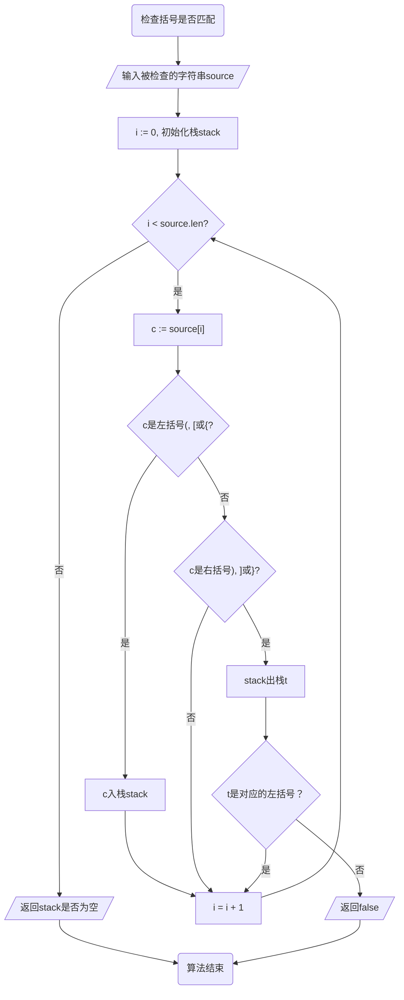

# Stack 栈

栈同样是一种线性结构，它只允许在末尾进行操作，并且遵循“先进后出”的原则。

举个例子，堆在桌子上的一叠书可以看作一个栈。放书时，只能放在最上面（末尾），拿书时也只能拿最上面那本（末尾最后一个元素）。要拿出最底下的书，必须从最顶上的书开始一本一本拿下来，这就是“先进先出”。

本章中，我们将借助第二章中实现的列表`SimpleArrayList`来实现栈。尽管如此，我还是不建议将本书中实现的程序用在实践中。

## 准备工作

在正式开始介绍和实现基本操作前，让我们先实现一些基础的函数和方法。

```zig -skip
pub fn Stack(T: type) type {
    return struct {
        const This = @This();
        const List = ArrayList(T);
        allocator: std.mem.Allocator,
        data: This.List,

        pub fn init(allocator: std.mem.Allocator) !This {
            return .{
                .allocator = allocator,
                .data = try This.List.init(allocator),
            };
        }

        pub fn top(self: This) usize {
            return self.data.len;
        }

        pub fn isEmpty(self: This) bool {
            return self.top() == 0;
        }

        pub fn deinit(self: *This) void {
            self.data.deinit();
        }
    };
}
```

首先，我们保存了This和List两个类型，来方便我们的后续使用。通过保存List，在有需要的时候，我们可以方便地把List的值修改为其他值，而不用修改代码中其他出现List的地方。当然，在我们简单的实现中，这并不是必要的。

随后，我们保存了一个allocator，并用这个allocator初始化了一个列表的示例用来保存数据。

然后，我们创建了初始化函数init和反初始化方法deinit，这个和前面的没有差别。

最后，我们创建了`top`方法和`isEmpty`方法。`top`方法返回下一个进入到栈中（入栈）的元素应该被保存到哪，而`isEmpty`方法判断栈是不是为空。我们将会进场用到这两个方法，把它们作为单独的方法可以让我们的程序更加清晰，也更加便于修改。

## 基本操作

栈并不复杂，它有下面的主要方法：

1. push：入栈一个元素；
2. pop：返回最后一个元素，并从栈中移除这个元素；
3. peek：返回最后一个元素，但不移除；

借助于先前实现的SimpleArrayList，我们可以不用手动管理内存了！

我们一个一个来。

### push

看着`push`的功能，你有没有觉得眼熟？没错，列表的`append`和它有着几乎一样的功能。因此，我们的实现只是简单的在`append`之外套了一层。

```zig -skip
pub fn push(self: *This, v: T) !void {
    try self.data.append(v);
}
```

### pop

记得第二章的挑战吗？如果你完成了挑战，那么这里的`pop`可以直接使用之前实现的pop。

如果没有，其实也很简单：通过nth获得最后一个元素，在通过removeNth删除这个元素就行。因为我们删除的是最后一个元素，所以也可以不用removeNth，直接长度减一就行。

于是，我们有下面的实现：

```zig -skip
pub fn pop(self: *This) ?T {
    if (self.isEmpty()) {
        // 空栈
        return null;
    }
    const lastIndex = self.top() - 1;
    //                                      👇 看这里 👇
    const last = self.data.nth(lastIndex) catch unreachable;
    // 使用函数进行修改
    // self.data.removeNth(lastIndex);
    // 或者手动修改
    self.data.len -= 1;
    return last;
}
```

注意看，我们又遇到了没见过的东西！

让我们回顾前面实现的`SimpleArrayList`，我们会发现`nth`函数返回的是一个错误联合类型，必须要处理错误才能拿到实际的值。

在以前的实现中，我们通过`try`关键字处理错误——遇到错误时返回错误，否则获得具体值。`catch`也是用来处理错误的，我们用一个简单的例子来说明：

```zig -singleFile
const std = @import("std");

pub fn errorIfZero(v: i32) !i32 {
    if (v == 0) {
        return error.Zero;
    } else {
        return v;
    }
}

pub fn main() !void {
    _ = errorIfZero(10086) catch {
        std.debug.print("I will not be printed.\n", .{});
    };

    _ = errorIfZero(0) catch {
        std.debug.print("I will be printed since you passed 0.\n", .{});
    };

    _ = errorIfZero(0) catch |err| {
        std.debug.print("Caught an error {!}\n", .{err});
    };
}
```

我们定义了一个函数，在传入0时返回错误，否则返回传入的数字。

第一个`catch`后面的语句不会被调用，因为`errorIfZero(10086)`会返回10086；第二个`catch`后面的语句会被调用，因为`errorIfZero(0)`会返回错误error.Zero；而在第三个`catch`后面的语句中，我们捕获了返回的错误，并且打印了错误的值。

通过`catch`关键字，我们能更加灵活的处理错误联合类型。

### peek

`peek`的功能有一点像`pop`，所以我们可以在pop的基础上做修改。

```zig -skip
pub fn peek(self: *This) ?T {
    if (self.isEmpty()) {
        // 空栈
        return null;
    }
    const lastIndex = self.top() - 1;
    const last = self.data.nth(lastIndex) catch unreachable;
    return last;
}
```

::: tip
Zig中，参数和返回值总是**按值传递**的，传入的参数和返回的值都是原始值的一份复制。

因此，通过`peek`获得的元素只是栈顶元素的一比一复刻，修改获得的元素并不会修改栈顶的那个元素。

你也可以实现`peekRef`方法，获得指向栈顶元素的指针而不是复制。
:::

## 测试

### push

我们要保证数据正确地入栈，并且没有影响前面的数据。我们可以通过直接方位`data`成员内部的`items`成员来做出判断。

```zig -skip
test "test push" {
    var stack = try Stack(i32).init(allocator);
    defer stack.deinit();

    const expected = [_]i32{ 1, 3, 4, 9, 1, 0, 111, 19928, 31415, 8008820 };
    for (expected) |value| {
        try stack.push(value);
        // 测试元素是否正确地入栈
        try expect(stack.top() != 0);
        try expect(stack.data.items[stack.top() - 1] == value);
    }
    try expect(std.mem.eql(i32, &expected, stack.data.items));
}
```

### pop

我们可以准备一组数据，将它们按顺序入栈。然后将它们的顺序翻转过来，再逐个出栈，确保实现了“先进后出”。最后，我们再试试弹出空栈能不能返回空值。

```zig -skip
test "test pop" {
    var stack = try Stack(i32).init(allocator);
    defer stack.deinit();

    var expected = [_]i32{ 1, 3, 4, 9, 1, 0, 111, 19928, 31415, 8008820 };
    for (expected) |value| {
        try stack.push(value);
    }

    // 出栈应该是先进后出
    std.mem.reverse(i32, &expected);
    // 一个个出栈并检查是否符合预期
    for (expected) |value| {
        const poped = stack.pop();
        try expect(poped != null and poped.? == value);
    }

    // 试图弹出空栈会返回空值
    try expect(stack.pop() == null);
}
```

### peek

```zig -skip
test "test peek" {
    var stack = try Stack(i32).init(allocator);
    defer stack.deinit();

    // 试图peek空栈会返回空值
    try expect(stack.peek() == null);

    const expectedSource = [_]i32{ 1, 3, 4, 9, 1, 0, 111, 19928, 31415, 8008820 };
    for (expectedSource) |value| {
        try stack.push(value);
    }
    const expected = expectedSource[expectedSource.len - 1]; // 预期的peek结果

    // 无论peek几次，返回的总是栈顶元素
    for (expected) |_| {
        const peeked = stack.peek();
        try expect(peeked != null and peeked.? == expected);
    }
}
```

## 应用示例 - 括号匹配

栈有很多用处，如函数调用、表达式求解、树的遍历等等。在这里，我们给出其中的一个应用——括号匹配。

在一般的使用中，括号总是成对出现的，也就是说，出现了'('后总是会在某个地方出现')'，中括号'[]'和大括号'{}'也是一样。我们可以实现一个函数来检查某一条字符串是否符合成对出现的规则。

让我们用**程序流程图**来整理一下我们的思路。

程序流程图是常见的表示算法流程的方式，我们使用圆角矩形表示程序的开始和结束，用矩形表示处理数据，用菱形表示分支，用带箭头的线表示程序执行的方向，使用既非矩形也非菱形的平行四边形来表示数据的输入输出。

我们的基本思路是：遍历给定字符串中的每一个字符，遇到左括号('(', '['或'{')时，使其入栈；遇到右括号(')', ']'或'}')时，取出栈顶元素，并对比是不是对应的左括号。因为栈是先进后出的，所以栈顶元素是最近的一个左括号。如果是对应的左括号，则继续，否则返回false。

在遍历所有字符后，如果栈不为空，就说明还有没被匹配的左括号，就说明括号无法正常匹配，则返回false；如果栈为空，就说明所有括号都有正确的对应，则返回true。

由此，可以得出下面的程序流程图：



上面的程序流程图是针对常规的通过下标遍历数组的语言编写的，对于Zig，我们并不需要一个i作为下标，也不需要检查i是否越界，这很大地简化了我们的程序。

我们有下面的实现，我们在程序中标注了主要的步骤：

```zig -test_collect_1
const std = @import("std");
const Stack = @import("lib/04_stack.zig").Stack;  // 👈替换为你的文件的位置

/// 检查括号（包括小括号、中括号以及大括号）是否匹配。
///
/// @param source 被检查的字符串。
/// @return
///   - `true` 如果所有括号都正确匹配。
///   - `false` 如果括号不匹配。
///   - 抛出错误（例如 OOM）。
///
/// @example
/// ```zig
/// const result = try checkParentness("()");
/// assert(result == true);
///
/// const result2 = try checkParentness("([)]");
/// assert(result2 == false);
/// ```
pub fn checkParentness(source: []const u8) !bool {
    // 准备分配器
    var arena = std.heap.ArenaAllocator.init(std.heap.page_allocator);
    const allocator = arena.allocator();
    defer arena.deinit(); // 通过ArenaAllocator，我们可以一口气释放所有分配的内存

    // 准备一个栈用于匹配
    var stack = try Stack(u8).init(allocator);
    // defer stack.deinit(); // 因为可以使用ArenaAllocator统一释放，所以我们可以不调用deinit

    // 遍历源字符串
    for (source) |c| {
        switch (c) {
            '(', '[', '{' => {
                try stack.push(c);
            },
            ')', ']', '}' => {
                const top = stack.pop();
                if (top) |t| {
                    const expected: u8 = switch (c) {
                        ')' => '(',
                        ']' => '[',
                        '}' => '{',
                        else => unreachable,
                    };
                    if (t != expected) {
                        return false;
                    }
                } else {
                    return false;
                }
            },
            else => {},
        }
    }
    return stack.isEmpty();
}
```

阅读上面的的代码，尝试将它和程序流程图对应起来吧！

另外，这里我们要介绍一种特殊的注释——**文档注释**。文档注释是由`///`（必须是刚好3个斜杠）开始的注释，它是一种多行注释，连续的文档注释会被视作同一个注释，并被展示在生成的文档中。你可以阅读[这个页面](https://ziglang.org/documentation/master/#Doc-Comments)来了解更多。

最后，让我们为函数编写测试：

```zig -test_1
const TestCase = struct {
    source: []const u8,
    expected: bool,
};

test "test checkParentness" {
    const cases = [_]TestCase{
        .{
            .source = "[({})]",
            .expected = true,
        },
        .{
            .source = "He[ll(o{Wo}rl)d]!",
            .expected = true,
        },
        .{
            .source = "[({})",
            .expected = false,
        },
        .{
            .source = "[({}]",
            .expected = false,
        },
        .{
            .source = "[({)]",
            .expected = false,
        },
        .{
            .source = "[(})]",
            .expected = false,
        },
        .{
            .source = "[{})]",
            .expected = false,
        },
        .{
            .source = "({})]",
            .expected = false,
        },
        .{
            .source = "})]",
            .expected = false,
        },
        .{
            .source = "[({",
            .expected = false,
        },
    };

    for (cases) |case| {
        const actual = try checkParentness(case.source);
        try std.testing.expect(actual == case.expected);
    }
}
```

## 挑战 - 斐波那契数列

斐波那契数列是一系列有意思的数字，它的数学定义如下：

$$
F(n) = \left\{\begin{matrix}
 0 & n = 0\\
 1 & n = 1\\
 F(n-1) + F(n-2) & else
\end{matrix}\right.
$$

一般来说，我们通常使用递归或者循环来求解斐波那契数列。但在这里，我们希望你能利用栈“先进先出”的特性来实现它。挑战自己吧！

## 完整代码

::: details 04_stack.zig
```zig -skip
const std = @import("std");

const ArrayList = @import("02_array.zig").SimpleArrayList;

pub fn Stack(T: type) type {
    return struct {
        const This = @This();
        const List = ArrayList(T);
        allocator: std.mem.Allocator,
        data: This.List,

        pub fn init(allocator: std.mem.Allocator) !This {
            return .{
                .allocator = allocator,
                .data = try This.List.init(allocator),
            };
        }

        pub fn push(self: *This, v: T) !void {
            try self.data.append(v);
        }

        pub fn pop(self: *This) ?T {
            if (self.isEmpty()) {
                // 空栈
                return null;
            }
            const lastIndex = self.top() - 1;
            const last = self.data.nth(lastIndex) catch unreachable;
            // 使用函数进行修改
            // self.data.removeNth(lastIndex);
            // 或者手动修改
            self.data.len -= 1;
            return last;
        }

        pub fn peek(self: *This) ?T {
            if (self.isEmpty()) {
                // 空栈
                return null;
            }
            const lastIndex = self.top() - 1;
            const last = self.data.nth(lastIndex) catch unreachable;
            return last;
        }

        pub fn top(self: This) usize {
            return self.data.len;
        }

        pub fn isEmpty(self: This) bool {
            return self.top() == 0;
        }

        pub fn deinit(self: *This) void {
            self.data.deinit();
        }
    };
}
```
:::

::: details 0402_stack_test.zig
```zig -skip
const std = @import("std");
const Stack = @import("04_stack.zig").Stack;

const expect = std.testing.expect;
const allocator = std.testing.allocator;

test "test push" {
    var stack = try Stack(i32).init(allocator);
    defer stack.deinit();

    const expected = [_]i32{ 1, 3, 4, 9, 1, 0, 111, 19928, 31415, 8008820 };
    for (expected) |value| {
        try stack.push(value);
        // 测试元素是否正确地入栈
        try expect(stack.top() != 0);
        try expect(stack.data.items[stack.top() - 1] == value);
    }
    try expect(std.mem.eql(i32, &expected, stack.data.items));
}

test "test pop" {
    var stack = try Stack(i32).init(allocator);
    defer stack.deinit();

    var expected = [_]i32{ 1, 3, 4, 9, 1, 0, 111, 19928, 31415, 8008820 };
    for (expected) |value| {
        try stack.push(value);
    }

    // 出栈应该是先进后出
    std.mem.reverse(i32, &expected);
    // 一个个出栈并检查是否符合预期
    for (expected) |value| {
        const poped = stack.pop();
        try expect(poped != null and poped.? == value);
    }

    // 试图弹出空栈会返回空值
    try expect(stack.pop() == null);
}

test "test peek" {
    var stack = try Stack(i32).init(allocator);
    defer stack.deinit();

    // 试图peek空栈会返回空值
    try expect(stack.peek() == null);

    const expectedSource = [_]i32{ 1, 3, 4, 9, 1, 0, 111, 19928, 31415, 8008820 };
    for (expectedSource) |value| {
        try stack.push(value);
    }
    const expected = expectedSource[expectedSource.len - 1]; // 预期的peek结果

    // 无论peek几次，返回的总是栈顶元素
    for (expected) |_| {
        const peeked = stack.peek();
        try expect(peeked != null and peeked.? == expected);
    }
}
```
:::

::: details 0403_stack_appliance.zig
```zig -skip
const std = @import("std");
const Stack = @import("04_stack.zig").Stack;

/// 检查括号（包括小括号、中括号以及大括号）是否匹配。
///
/// @param source 被检查的字符串。
/// @return
///   - `true` 如果所有括号都正确匹配。
///   - `false` 如果括号不匹配。
///   - 抛出错误（例如 OOM）。
///
/// @example
/// ```zig
/// const result = try checkParentness("()");
/// assert(result == true);
///
/// const result2 = try checkParentness("([)]");
/// assert(result2 == false);
/// ```
pub fn checkParentness(source: []const u8) !bool {
    // 准备分配器
    var arena = std.heap.ArenaAllocator.init(std.heap.page_allocator);
    const allocator = arena.allocator();
    defer arena.deinit(); // 通过ArenaAllocator，我们可以一口气释放所有分配的内存

    // 准备一个栈用于匹配
    var stack = try Stack(u8).init(allocator);
    // defer stack.deinit(); // 因为可以使用ArenaAllocator统一释放，所以我们可以不调用deinit

    // 遍历源字符串
    for (source) |c| {
        switch (c) {
            '(', '[', '{' => {
                try stack.push(c);
            },
            ')', ']', '}' => {
                const top = stack.pop();
                if (top) |t| {
                    const expected: u8 = switch (c) {
                        ')' => '(',
                        ']' => '[',
                        '}' => '{',
                        else => unreachable,
                    };
                    if (t != expected) {
                        return false;
                    }
                } else {
                    return false;
                }
            },
            else => {},
        }
    }
    return stack.isEmpty();
}

const TestCase = struct {
    source: []const u8,
    expected: bool,
};

test "test checkParentness" {
    const cases = [_]TestCase{
        .{
            .source = "[({})]",
            .expected = true,
        },
        .{
            .source = "He[ll(o{Wo}rl)d]!",
            .expected = true,
        },
        .{
            .source = "[({})",
            .expected = false,
        },
        .{
            .source = "[({}]",
            .expected = false,
        },
        .{
            .source = "[({)]",
            .expected = false,
        },
        .{
            .source = "[(})]",
            .expected = false,
        },
        .{
            .source = "[{})]",
            .expected = false,
        },
        .{
            .source = "({})]",
            .expected = false,
        },
        .{
            .source = "})]",
            .expected = false,
        },
        .{
            .source = "[({",
            .expected = false,
        },
    };

    for (cases) |case| {
        const actual = try checkParentness(case.source);
        try std.testing.expect(actual == case.expected);
    }
}
```
:::